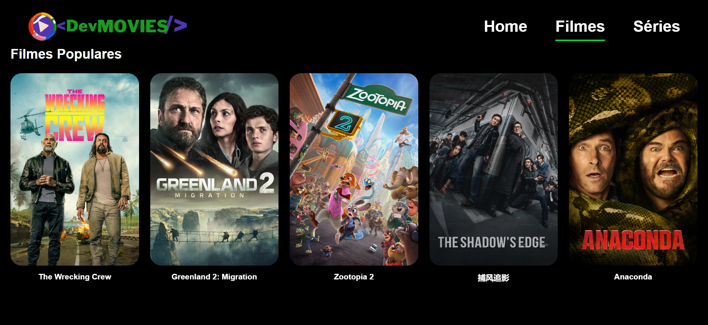
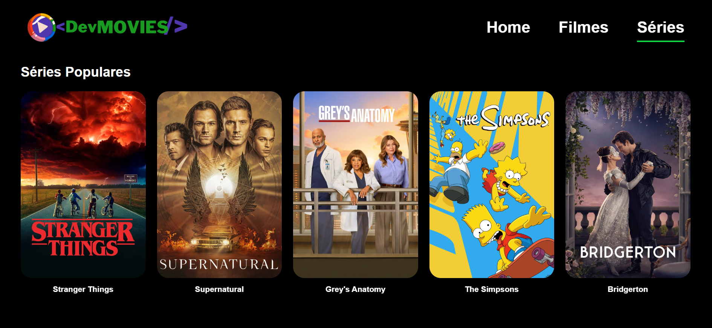

# 🎬 Devsine Movies

Um projeto web inspirado na Netflix, que consome a API do **The Movie Database (TMDB)** para exibir filmes, séries, trailers e informações detalhadas.

---

## 🚀 Demonstração

🔗 Em breve disponível online  
(ou rode localmente seguindo os passos abaixo)

---

## 📸 Preview

- Home com banner em destaque  
- Listas de filmes e séries em sliders  
- Página de detalhes com informações completas  
- Modal para assistir trailers  
- Navegação fluida entre páginas  
## 🏠 Home


## 🎬 Filmes


## 📺 Séries


---

## 🛠️ Tecnologias Utilizadas

- **React JS**
- **Vite**
- **React Router DOM**
- **Styled-components**
- **Axios**
- **TMDB API**

---

## ⚙️ Instalação

Clone o repositório:

```bash
git clone https://github.com/seu-usuario/devsine-movies.git


Entre na pasta do projeto:

cd devsine-movies


Instale as dependências:

npm install


Crie um arquivo .env na raiz com sua chave da API TMDB:

VITE_API_KEY=Sua_Chave_Aqui


Inicie o projeto:

npm run dev


Acesse no navegador:

http://localhost:5173

🔑 API

Este projeto utiliza a API gratuita do
👉 https://www.themoviedb.org/

📂 Estrutura do Projeto
src/
 ├── components/
 ├── containers/
 ├── services/
 ├── routes/
 ├── utils/
 └── layout/

✨ Funcionalidades

✔️ Listagem de filmes populares
✔️ Listagem de séries populares
✔️ Página de detalhes
✔️ Trailer em modal
✔️ Sliders interativos
✔️ Layout responsivo

👨‍💻 Autor

Desenvolvido por Welinson G 🚀

📜 Licença

Este projeto é apenas para fins educacionais.


---

## ✅ Como usar

1. Crie um arquivo chamado **README.md** na raiz do projeto  
2. Cole o conteúdo acima  
3. Suba para o GitHub  
